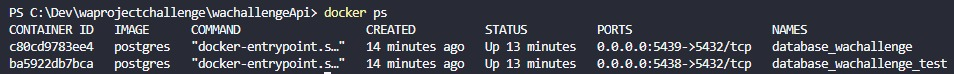
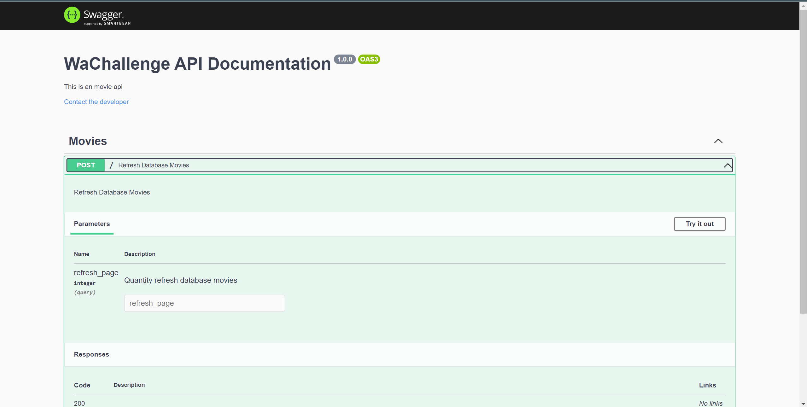

<!-- GETTING STARTED -->

## Getting Started

Esse projeto está hospedado no EC2 da AWS nas seguintes urls:

backend: http://54.94.208.8:5001/
frontend: http://54.94.208.8:5173/

### Pré-requisitos

1. Git. Para instalar [clique aqui](https://git-scm.com/book/en/v2/Getting-Started-Installing-Git)

2. Node e npm. Para instalar [clique aqui](https://nodejs.org/en/download/)

3. Docker. Para instalar [clique aqui](https://docs.docker.com/get-docker/)

4. Verifique as se as instalações ocorreram com sucesso
   ```sh
   git --version
   ```
   ```sh
   npm --version
   ```
   ```sh
   docker --version
   ```

<p align="right">(<a href="#readme-top">back to top</a>)</p>

### Instalação

1. Clone o repositorio
   ```sh
   git clone https://github.com/arthurfcs98/waprojectchallenge.git
   ```
2. Entre na pasta do projeto e em seguida na pasta do backend
   ```sh
   cd .\waprojectchallenge\wachallengeApi\
   ```
3. Instale as dependencias

   ```sh
   npm install
   ```

4. Criar os bancos de dados da aplicação

   - <b> O docker precisa estar rodando na sua maquina e as portas 5438 e 5439 precisam estar livres</b>

   ```sh
    docker-compose up --no-start
   ```

   Em seguida:

   ```sh
    docker-compose start
   ```

   Para verificar se está tudo correto execute:

   ```sh
    docker ps
   ```

   O resultado deve ser algo parecido com isso<br>
   <br>
   <br>

5. Execute o script de migrations da aplicação
   ```sh
   npm run migration:run
   ```
6. Renomei o arquivo .env.example para .env e em seguida adicione a seguinte chave/valor no arquivo:
   ```sh
   TMDB_KEY=046737395d6eaf12439f4096fc13f824
   ```
7. Execute o script dev da aplicação
   ```sh
   npm run dev
   ```
8. Em outro terminal entre no diretorio do repositorio e depois entre na pasta wachallengeFrontEnd
   ```sh
   cd .\wachallengeFrontEnd\
   ```
9. Instale as dependencias
   ```sh
   npm install
   ```
10. Inicie a aplicação
    ```sh
    npm run dev
    ```

Desse modo a aplicão ja estará sendo executada, tanto o backend quanto o frontend.

<p align="right">(<a href="#readme-top">back to top</a>)</p>

## Usage

Acesse a documentação da API em:
http://localhost:5001/api-docs ou http://54.94.208.8:5001/api-docs

Documentação<br>
<br>
FrontEnd<br>
<br>
FrontEnd<br>
<br>

<p align="right">(<a href="#readme-top">back to top</a>)</p>

##Tests

1. Entre na pasta server
   ```sh
   cd ./wachallengeApi/
   ```
2. Execute o arquivo teste em específico
   ```sh
   npm run test
   ```

## Contact

Your Name - cesarinoarthur@gmail.com

Project Link: [https://github.com/arthurfcs98/hiring-node](https://github.com/hiring/hiring-node)

<p align="right">(<a href="#readme-top">back to top</a>)</p>
